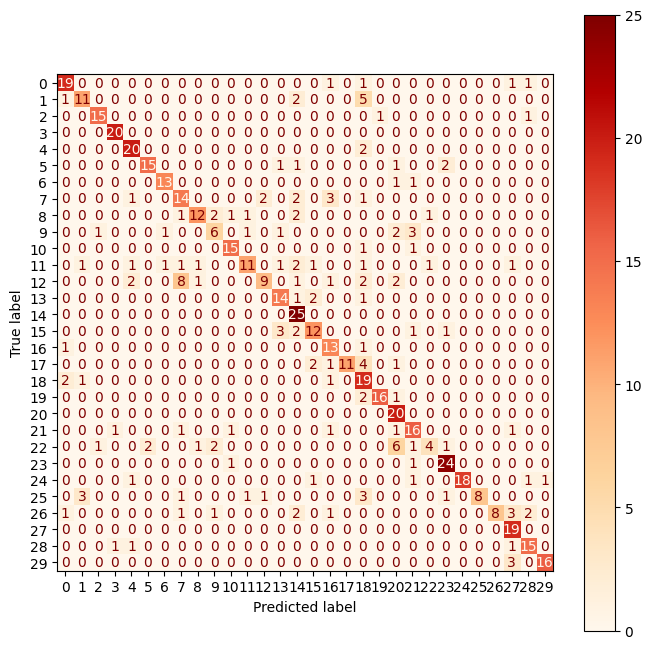

# Dog Breed Classification Project 🐾
## Data Source 📊

The data for this project is sourced from the Stanford Dogs Dataset.

## Stanford dog dataset : dog breed classification 📦

**Python Notebooks**:
- exploratory_and_data_preparation.ipynb : EDA and image and datasets preparation
- transfer_learning.ipynb : Xception transfer learning and training
- model_architecture_development.ipynb : data augmentation and CNN architecture development with **keras** and **mlflow** 
- nn_evaluation.ipynb : benchmark between transfer learning model and CNN specific architecture model

**Script for Image Classification**:
- run_classification.py : image classification script using transfer learning model 

## Presentation in French
- etat_de_lart.pdf : state of the art of image neural network overview
- pesentation.pdf : presentation slides

## Confusion matrix of the transfer learning model : 

